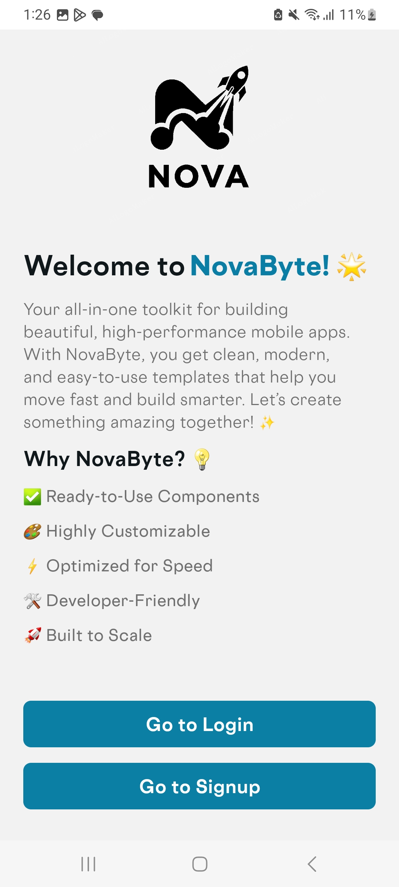
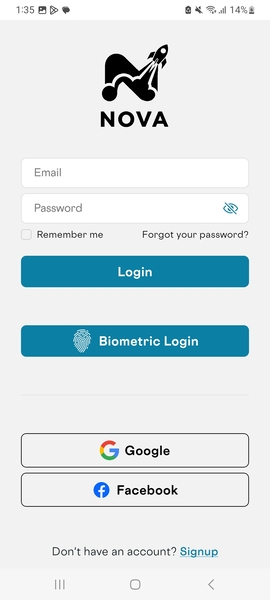
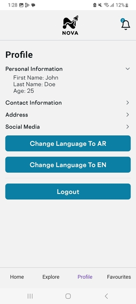
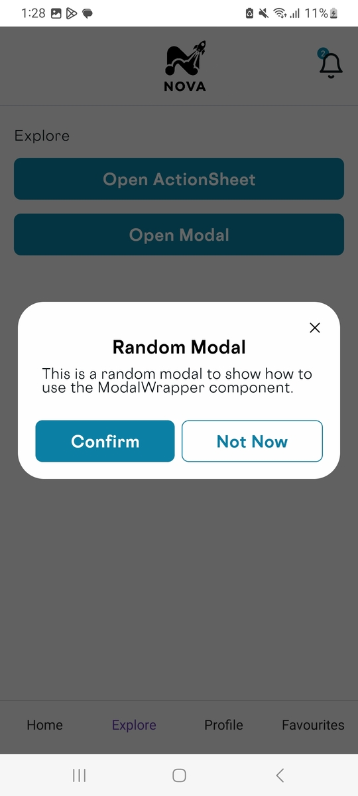
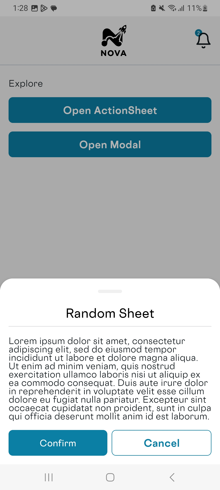
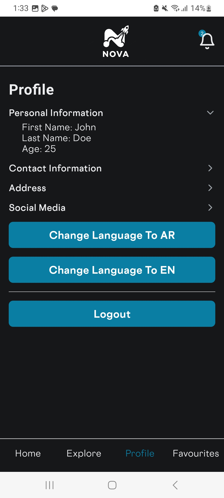

# 🚀 **Expo Template**

This is a React Native template built with Expo 52. It provides a modern and responsive foundation for building mobile applications. It includes:

- Navigation (Auth/Main stacks)
- Theming and styling
- API integration
- State management
- Localization using i18n
- Reusable components
- Utility functions
- Custom hooks
- Scripts for easing development tasks
- Building tool (EAS)
- An overall ready-for-integration template with an atomic design system.

## ✨ Features

- **[React Native](https://reactnative.dev/)**: A framework for building native apps using React.
- **[Expo](https://expo.dev/)**: A framework and platform for universal React applications.
- **[TypeScript](https://www.typescriptlang.org/)**: A strongly typed programming language that builds on JavaScript.
- **[React Navigation](https://reactnavigation.org/)**: Routing and navigation for React Native apps.
- **[Redux Toolkit](https://redux-toolkit.js.org/)**: A toolset for efficient Redux development.
- **[RTK Query](https://redux-toolkit.js.org/rtk-query/overview)**: Powerful data fetching and caching tool.
- **[React Toastify](https://fkhadra.github.io/react-toastify/)**: Easy-to-use toast notifications.
- **[React-i18next](https://react.i18next.com/)**: Internationalization for React Native.
- **[Day.js](https://day.js.org/)**: A lightweight JavaScript date library.
- **[React Hook Form](https://react-hook-form.com/)**: Performant, flexible, and extensible forms with easy-to-use validation.
- **[Atomic Design System](https://bradfrost.com/blog/post/atomic-web-design/)**: A methodology for creating design systems.
- **[Husky](https://typicode.github.io/husky/)** (optional): Git hooks made easy.
- **[ESLint](https://eslint.org/)** (optional): A tool for identifying and fixing problems in JavaScript code.
- **[Sentry](https://sentry.io/)** (optional): Error monitoring software.
- **Reusable Components**: Modular and reusable components for easy customization.
- **State Management**: Integrated state management using Redux or context.

## 🛠️ Installation

To get started with this project, follow these steps:

1. Install the Template:
   ```bash
   npx create-nova-expo-template
   ```
2. Navigate to the project directory:
   ```bash
   cd <project-name>
   ```
3. Install the dependencies:

   ```bash
   npm install
   ```

### Prerequisites

Ensure you have the following installed:

- **Node.js**: v16.14.0 or higher (currently using v20.17.0)
- **npm**: v8.5.0 or higher (currently using v10.8.2)

## 📚 Usage

To start the development server, run:

```bash
npm start
```

To build the project for production, run:

```bash
expo build
```

To preview the production build, run:

```bash
expo start --no-dev --minify
```

## 📸 Screenshots

Here are some screenshots of the application:








## 📋 Changelog

See the [CHANGELOG](CHANGELOG.md) for a history of changes to this project.

## 🤝 Contributing

Contributions are welcome! Please read the [contributing guidelines](CONTRIBUTING.md) first.

## 📄 License

This project is licensed under the MIT License.
