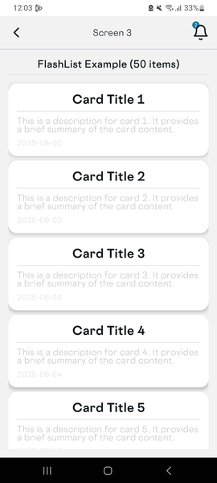

# 🚀 **Expo Template**

This is a React Native template built with Expo 54. It provides a modern and responsive foundation for building mobile applications. It includes:

- Navigation (Auth/Main stacks)
- Theming and styling
- API integration
- State management
- Localization using i18n
- Reusable components
- Utility functions
- Custom hooks
- Scripts for easing development tasks
- Building tool (EAS)
- An overall ready-for-integration template with an atomic design system.

## 📋 Table of Contents

- [✨ Features](#-features)
- [🛠️ Installation](#️-installation)
- [⚙️ Prerequisites](#️-prerequisites)
- [📚 Usage](#-usage)
- [📸 Screenshots](#-screenshots)
- [🏗️ Project Structure](#️-project-structure)
- [📋 Changelog](#-changelog)
- [🤝 Contributing](#-contributing)
- [📄 License](#-license)

## ✨ Features

- **[React Native](https://reactnative.dev/)**: A framework for building native apps using React.
- **[Expo](https://expo.dev/)**: A framework and platform for universal React applications.
- **[TypeScript](https://www.typescriptlang.org/)**: A strongly typed programming language that builds on JavaScript.
- **[React Navigation](https://reactnavigation.org/)**: Routing and navigation for React Native apps.
- **[Redux Toolkit](https://redux-toolkit.js.org/)**: A toolset for efficient Redux development.
- **[RTK Query](https://redux-toolkit.js.org/rtk-query/overview)**: Powerful data fetching and caching tool.
- **[React Toastify](https://fkhadra.github.io/react-toastify/)**: Easy-to-use toast notifications.
- **[React-i18next](https://react.i18next.com/)**: Internationalization for React Native.
- **[Day.js](https://day.js.org/)**: A lightweight JavaScript date library.
- **[Flashlist](https://shopify.github.io/flash-list/)**: A performant list component for React Native.
- **[React Hook Form](https://react-hook-form.com/)**: Performant, flexible, and extensible forms with easy-to-use validation.
- **[Atomic Design System](https://bradfrost.com/blog/post/atomic-web-design/)**: A methodology for creating design systems.
- **[Husky](https://typicode.github.io/husky/)** (optional): Git hooks made easy.
- **[ESLint](https://eslint.org/)** (optional): A tool for identifying and fixing problems in JavaScript code.
- **[Sentry](https://sentry.io/)** (optional): Error monitoring software.
- **Reusable Components**: Modular and reusable components for easy customization.
- **State Management**: Integrated state management using Redux or context.

## 🛠️ Installation

To get started with this project, follow these steps:

1. Install the Template:
   ```bash
   npx create-nova-expo-template
   ```
2. Navigate to the project directory:
   ```bash
   cd <project-name>
   ```
3. Run the project:

   ```bash
   npm start
   ```

### ⚙️ Prerequisites

Ensure you have the following installed:

- **Node.js**: v16.14.0 or higher (currently using v20.17.0)
- **npm**: v8.5.0 or higher (currently using v10.8.2)

## 📚 Usage

To start the development server, run:

```bash
npm start
```

To build the project for production, run:

```bash
expo build
```

To preview the production build, run:

```bash
expo start --no-dev --minify
```

## 📸 Screenshots

Here are some screenshots of the application:




## 🏗️ Project Structure

```
your-app-name/                     # Your new Expo app
├── 📄 app.json                    # Expo app configuration
├── 📄 eas.json                    # EAS Build configuration
├── 📄 expo-env.d.ts               # Expo environment types
├── 📄 package.json                # Project dependencies
├── 📄 tsconfig.json               # TypeScript configuration
│
├── 📁 @types/                     # Global TypeScript definitions
│   ├── 📄 static-files.d.ts       # Static file types
│   └── 📄 TranslationKeyEnum.ts   # Translation key enums
│
├── 📁 apis/                       # API layer
│   ├── 📄 Domain.ts               # API domain configuration
│   ├── 📄 index.ts                # API exports
│   ├── 📄 tagTypes.ts             # RTK Query tag types
│   ├── 📁 @types/                 # API type definitions
│   ├── 📁 middlewares/            # API middlewares
│   └── 📁 services/               # API service endpoints
│
├── 📁 app/                        # App routing (Expo Router)
│   ├── 📄 _layout.tsx             # Root layout
│   ├── 📄 +not-found.tsx          # 404 page
│   ├── 📄 index.tsx               # Home/Landing page
│   ├── 📁 (auth)/                 # Authentication stack
│   │   ├── 📄 _layout.tsx         # Auth layout
│   │   ├── 📁 forgotPassword/     # Password reset screens
│   │   ├── 📁 login/              # Login screens
│   │   ├── 📁 signup/             # Registration screens
│   │   └── 📁 welcome/            # Welcome/onboarding
│   └── 📁 (main)/                 # Main app stack
│       ├── 📄 _layout.tsx         # Main layout
│       ├── 📁 (tabs)/             # Tab navigation
│       ├── 📁 screen1/            # Feature screens
│       ├── 📁 screen2/
│       └── 📁 screen3/
│
├── 📁 assets/                     # Static assets
│   ├── 📁 fonts/                  # Custom fonts
│   ├── 📁 icons/                  # Icon components
│   ├── 📁 images/                 # Image assets
│   └── 📁 svgs/                   # SVG components
│
├── 📁 components/                 # UI Components (Atomic Design)
│   ├── 📁 atoms/                  # Basic building blocks
│   │   ├── 📁 Button/             # Button component
│   │   ├── 📁 Input/              # Input component
│   │   ├── 📁 Text/               # Text component
│   │   └── 📄 index.ts            # Atom exports
│   ├── 📁 molecules/              # Component combinations
│   │   ├── 📁 common/             # Shared molecules
│   │   └── 📁 scoped/             # Feature-specific molecules
│   ├── 📁 organisms/              # Complex components
│   │   ├── 📁 common/             # Shared organisms
│   │   └── 📁 scoped/             # Feature-specific organisms
│   ├── 📁 templates/              # Page templates
│   └── 📁 wrappers/               # Higher-order components
│
├── 📁 constants/                  # App constants
│   ├── 📄 Colors.ts               # Color palette
│   ├── 📄 FontFamily.ts           # Font definitions
│   ├── 📄 GlobalStyles.ts         # Global styles
│   ├── 📄 Metrics.ts              # Screen dimensions
│   └── 📄 TranslationConfig.ts    # i18n configuration
│
├── 📁 hooks/                      # Custom React hooks
│   ├── 📄 useBiometricLogin.tsx   # Biometric authentication
│   ├── 📄 useColorScheme.ts       # Theme management
│   ├── 📄 useFetchTranslation.ts  # Localization hook
│   └── 📄 useThemeColor.ts        # Color theme hook
│
├── 📁 locale/                     # Internationalization
│   ├── 📄 ar.json                 # Arabic translations
│   ├── 📄 en.json                 # English translations
│   └── 📄 index.ts                # i18n exports
│
├── 📁 redux/                      # State management
│   ├── 📄 index.ts                # Store configuration
│   ├── 📄 appReducer.ts           # App state slice
│   └── 📄 authReducer.ts          # Auth state slice
│
├── 📁 scripts/                    # Development scripts
│   ├── 📄 generate-svg.js         # SVG component generator
│   ├── 📄 removeLogs.js           # Production log removal
│   ├── 📄 sync-translations.js    # Translation sync
│   └── 📄 translate.js            # Auto-translation tool
│
├── 📁 styles/                     # Global styles
│
└── 📁 utils/                      # Utility functions
    ├── 📄 debounce.ts             # Debounce utility
    ├── 📄 handleErrors.ts         # Error handling
    ├── 📄 loginHandler.ts         # Authentication helpers
    └── 📄 showSuccessMsg.ts       # Success messaging
```

### 📂 Key Directories Explained

- **`app/`**: Uses Expo Router for file-based routing with layout components
- **`components/`**: Follows Atomic Design methodology (atoms → molecules → organisms → templates)
- **`apis/`**: Centralized API layer with RTK Query for data fetching and caching
- **`redux/`**: State management using Redux Toolkit with separate slices
- **`hooks/`**: Custom React hooks for reusable logic
- **`constants/`**: App-wide constants including colors, fonts, and metrics
- **`locale/`**: Multi-language support with JSON translation files
- **`utils/`**: Helper functions and utilities
- **`scripts/`**: Development automation scripts

## 📋 Changelog

See the [CHANGELOG](CHANGELOG.md) for a history of changes to this project.

## 🤝 Contributing

Contributions are welcome! Please read the [contributing guidelines](CONTRIBUTING.md) first.

## 📄 License

This project is licensed under the MIT License.
